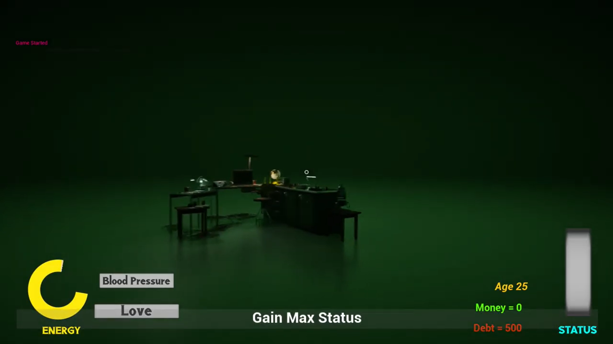
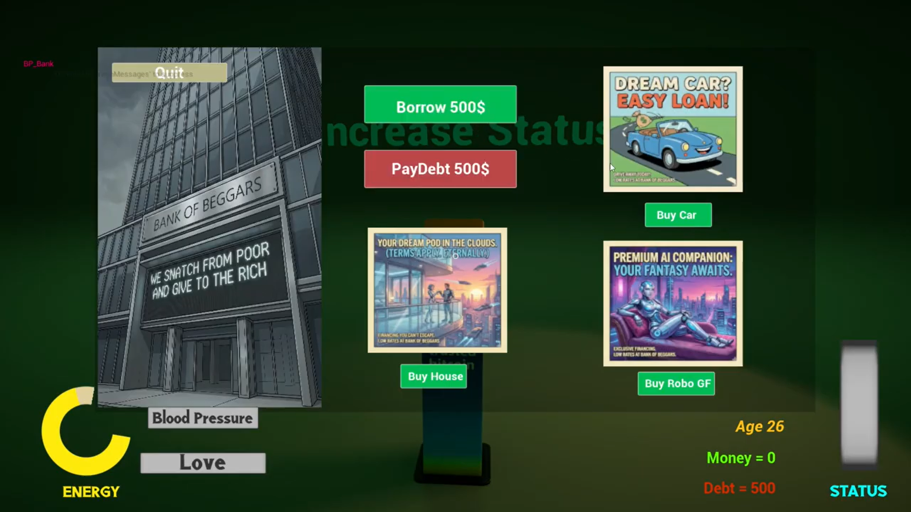
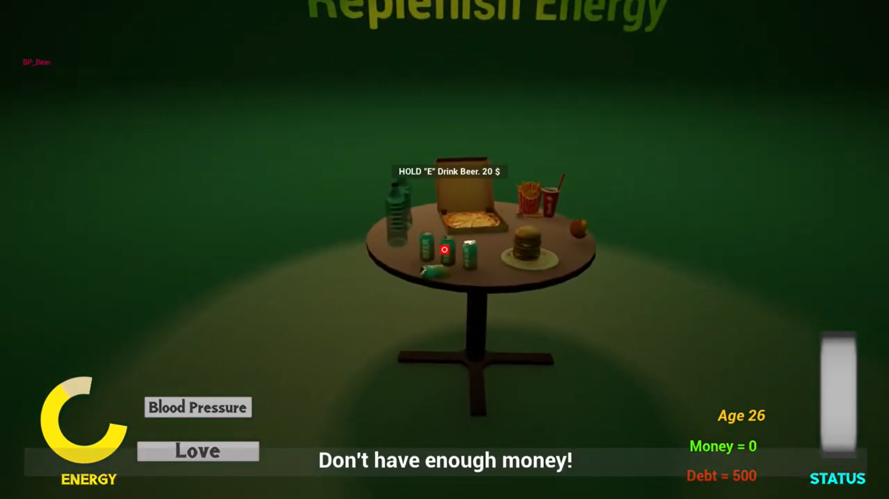
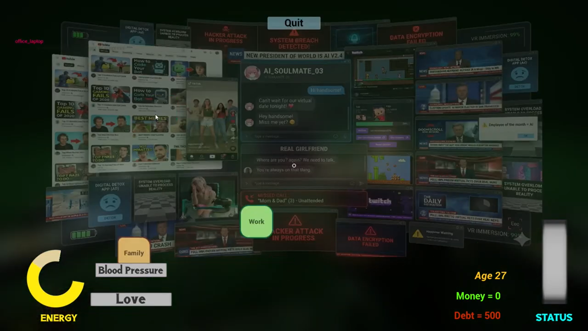
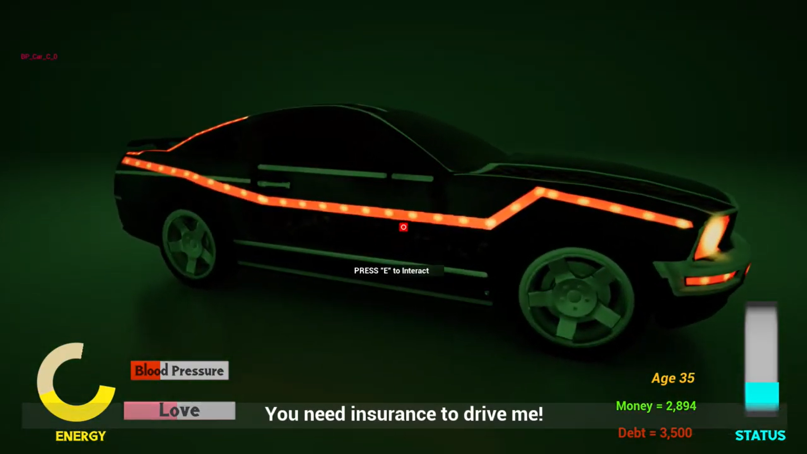
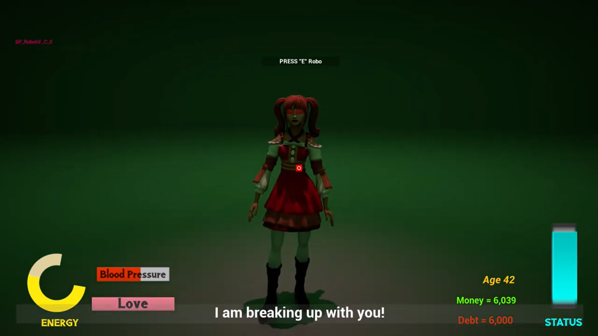
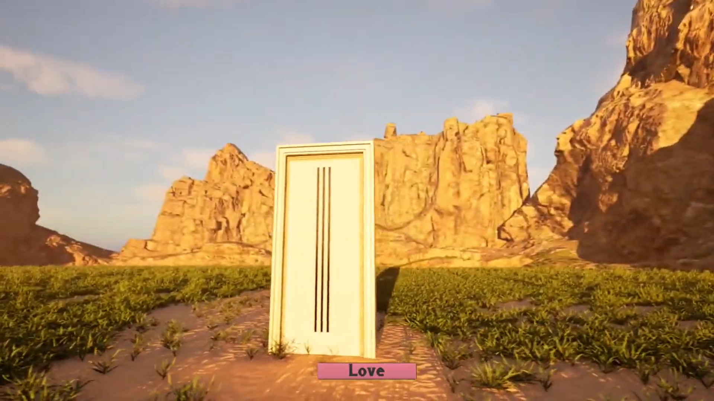
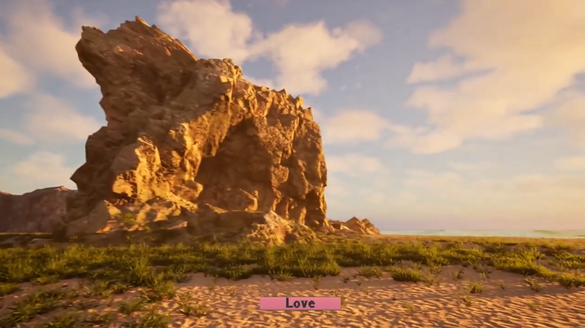
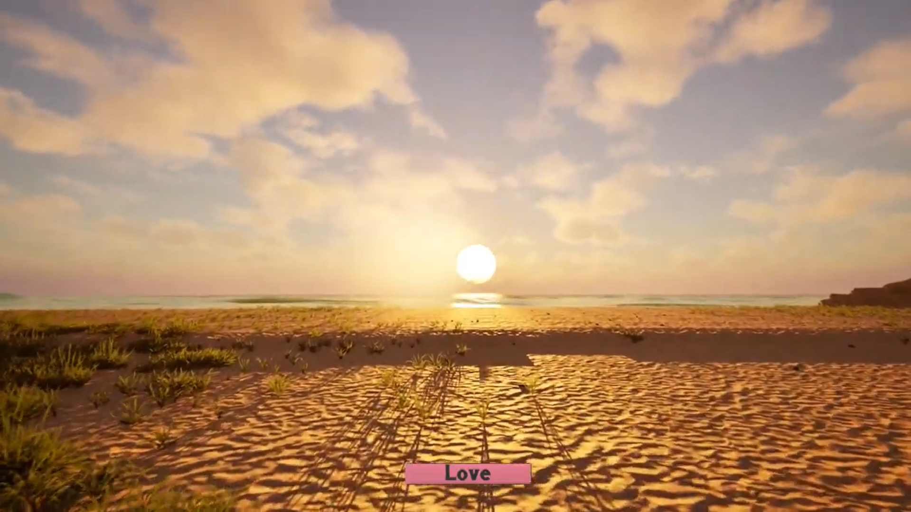
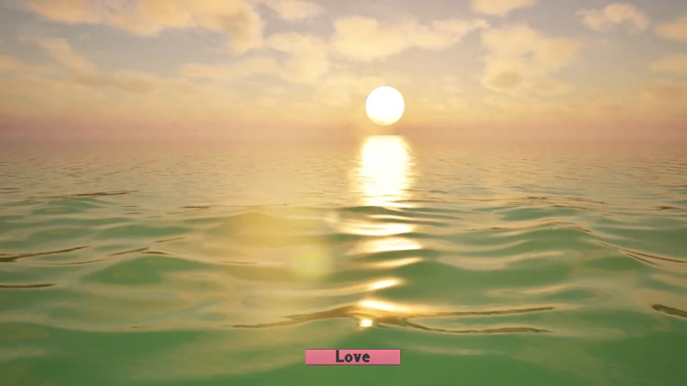

# 🌿 Green Void

  

## 📖 Overview

Green Void is a cinematic Gameplay project developed in Unreal Engine 5. The project focuses on storytelling through Gameplay design, lighting, composition, and atmospheric visuals. It demonstrates real-time rendering techniques and cinematic world-building.

---

## ✨ Features

- 🌿 Detailed Gameplay Design
- 🌅 Cinematic Lighting
- 🎬 Real-Time Rendering
- 🌊 Atmospheric Storytelling
- 🪨 High-Quality Assets using Quixel Megascans
- 🔵 Blueprint-based interactions

---

## 🛠 Tech Stack

- Unreal Engine 5
- Blueprints
- Quixel Megascans
- Lumen
- Nanite
- Sequencer

---

## 🎥 Demo Video

https://youtu.be/R2dUhEGAgqs

---

## 📸 Gallery

  
  
  
  
  
  

---

## 👨‍💻 My Contribution

- Designed and built the Gameplay
- Created cinematic camera sequences
- Configured lighting and post-processing
- Optimized assets for real-time rendering
- Developed Blueprint interactions

---

## 🚀 Future Improvements

- Dynamic weather system
- Interactive Gameplay elements
- Day/Night cycle
- Enhanced visual effects

---

⭐ If you enjoyed this project, don't forget to star the repository!
